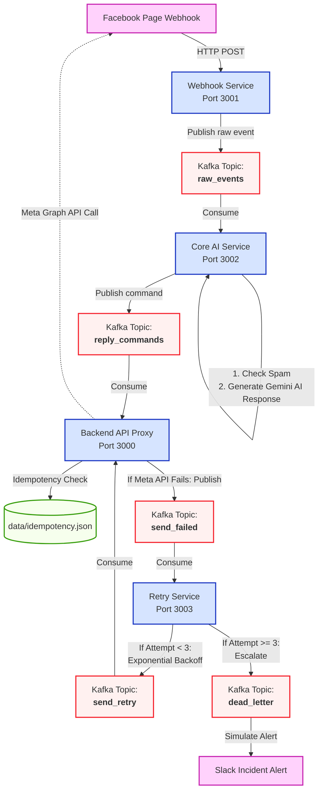

# 🤖 Facebook Page Automation System - Monorepo Microservices

[](https://kafka.apache.org/)
[](https://deepmind.google/technologies/gemini/)
[](https://www.docker.com/)
[](https://nodejs.org/)

Hệ thống tự động hóa phản hồi và quản lý tương tác trên **Facebook Page** chuyên nghiệp, thiết kế chuẩn theo kiến trúc **Event-Driven Microservices** và được quản lý tập trung bằng mô hình **Monorepo**. 

Hệ thống sử dụng hàng đợi thông điệp **Apache Kafka** để đảm bảo khả năng mở rộng tối đa (scalability), xử lý bất đồng bộ (asynchronous processing), cơ chế chống trùng lặp dữ liệu nghiêm ngặt (idempotency store), tích hợp trí tuệ nhân tạo **Gemini AI** để tạo phản hồi tự sinh thông minh vượt trội, và được bảo vệ bởi cơ chế tự động thử lại lỗi (Exponential Backoff Retry) thông qua hàng đợi thư chết (Dead Letter Queue - DLQ).

---

## 📐 Kiến trúc Hệ thống & Luồng Dữ liệu (E2E)

Hệ thống bao gồm các dịch vụ phân tán, liên kết lỏng lẻo (loosely coupled) và giao tiếp bất đồng bộ qua **Kafka Topics** nhằm tối đa hóa hiệu năng và khả năng chịu lỗi (fault tolerance):



### 🔁 Mô tả chi tiết Luồng Sự kiện (Event Flow)
1. **Tiếp nhận & Chuẩn hóa**: Khi khách hàng tương tác trên Facebook Page, Meta Webhooks gửi Payload HTTP POST tới **Webhook Service** (Port 3001). Webhook Service ký thực chữ ký bảo mật `X-Hub-Signature-256`, chuẩn hóa dữ liệu đầu vào và phát hành sự kiện `raw_events` vào Kafka.
2. **Xử lý Thông minh**: **Core AI Service** tiêu thụ sự kiện từ `raw_events`, lọc tin nhắn spam/quảng cáo độc hại bằng bộ quy tắc tùy biến, rồi gọi **Gemini AI API** để sinh câu trả lời tự động tinh tế theo ngữ cảnh thực tế của khách hàng. Sau đó phát sự kiện phản hồi vào `reply_commands`.
3. **Thực thi An toàn**: **Backend API Proxy** tiêu thụ sự kiện từ `reply_commands`, thực thi cơ chế **Idempotency Check** nhằm triệt tiêu hoàn toàn rủi ro gửi trùng lặp tin nhắn (double delivery) từ Kafka. Nếu hợp lệ, dịch vụ sẽ thực hiện cuộc gọi qua API Graph của Meta để trả lời bình luận của khách hàng.
4. **Tự động Khắc phục Lỗi**: Nếu cuộc gọi API của Meta thất bại (do sự cố mạng, token lỗi...), **Backend API Proxy** sẽ đẩy lỗi vào topic `send_failed`. **Retry Service** sẽ tiếp nhận và tiến hành thử lại tự động theo khoảng thời gian tăng dần hình học (Exponential Backoff). Nếu thất bại quá 3 lần, sự kiện sẽ được cô lập vào **Dead Letter Queue (DLQ)** để cảnh báo lập tức.

---

## 📁 Cấu trúc Thư mục Monorepo

```text
/ (Root)
├── services/
│   ├── webhook-service/        # Tiếp nhận Webhooks từ Meta, kiểm tra chữ ký X-Hub-Signature-256 (Port 3001)
│   ├── core-service/           # Phân tích nội dung, lọc spam & tích hợp Gemini AI (Port 3002)
│   ├── backend-api/            # API quản trị bài viết, Swagger UI, Check trùng Idempotent & gửi tin (Port 3000)
│   └── retry-service/          # Quản lý hàng đợi lỗi, Exponential Backoff & cô lập DLQ (Port 3003)
│
├── shared/                     # Mã nguồn & Tiện ích dùng chung cho các Microservices
│   ├── constants.js            # Khai báo tập trung các Kafka Topics và cấu hình tĩnh
│   └── logger.js               # Winston Logger cấu hình sẵn hiển thị log màu sắc trực quan theo chuẩn dịch vụ
│
├── docker-compose.yml          # Trình điều phối chạy hạ tầng (Zookeeper, Kafka, Kafka UI) & microservices
├── .env                        # Chứa cấu hình môi trường bảo mật của hệ thống (được Gitignore)
├── .env.example                # File cấu hình mẫu cung cấp cấu trúc cho việc phân phối cấu hình
├── package.json                # Quản lý scripts khởi chạy tập trung của Monorepo
└── test_webhook.js             # Kịch bản giả lập Meta Webhook phục vụ việc kiểm thử luồng End-to-End
```

---

## ⚙️ Cấu hình Môi trường (`.env`)

Sao chép tệp tin cấu hình mẫu gốc `.env.example` thành `.env` tại thư mục gốc và cung cấp các giá trị thích hợp:

| Biến Môi Trường | Giá trị Mặc định | Ý nghĩa | Chi tiết cấu hình |
| :--- | :--- | :--- | :--- |
| **PORT** | `3000` | Port chạy Backend API | Phục vụ Swagger UI, điều phối gửi tin và các API quản trị |
| **GRAPH_API_VERSION** | `v23.0` | Meta Graph API Version | Phiên bản API Graph của Facebook đang sử dụng |
| **PAGE_ACCESS_TOKEN** | *Bắt buộc* | Facebook Page Access Token | Token có quyền `pages_messaging`, `pages_manage_metadata` |
| **PAGE_ID** | *Bắt buộc* | ID của Facebook Page | ID của Trang cần tự động hóa tương tác |
| **ADMIN_TOKEN** | `admin_thanhngan_123` | Bearer Token Bảo mật | Bảo vệ các route API Admin nhạy cảm |
| **FACEBOOK_VERIFY_TOKEN** | `thanhngan` | Verification Token Webhook | Sử dụng khi thiết lập liên kết Webhook trên Facebook Developers |
| **FACEBOOK_APP_SECRET** | *Bắt buộc* | App Secret Key | Khóa bí mật dùng để kiểm tra tính toàn vẹn gói tin Webhook |
| **WEBHOOK_SKIP_SIGNATURE**| `false` | Bỏ qua xác thực chữ ký | Đặt thành `true` khi phát triển giả lập để đơn giản hóa kiểm thử |
| **GEMINI_API_KEY** | *Tùy chọn* | Google Gemini API Key | Nếu không có, Core Service tự động sử dụng Mock Responses chất lượng |

---

## 🚀 Hướng dẫn Cài đặt & Khởi chạy nhanh

### 🐳 Cách 1: Sử dụng Docker Compose (Được khuyên dùng nhất)

Yêu cầu máy tính đã cài đặt sẵn **Docker** và **Docker Desktop** (hoặc Docker Compose daemon).

1. **Khởi chạy toàn bộ hệ thống (Hạ tầng + Services):**
   ```bash
   npm run docker:up
   ```
   *Lệnh này thực hiện tự động: khởi chạy Zookeeper, Kafka Broker, Kafka UI, tự động build 4 Dockerfile cho 4 microservices và kích hoạt đồng thời.*

2. **Dừng và dọn dẹp tài nguyên:**
   ```bash
   npm run docker:down
   ```

### 💻 Cách 2: Chạy trực tiếp trong môi trường Local (Development Mode)

Yêu cầu đã cài đặt **Node.js (v18+)** và có một cụm Kafka đang hoạt động cục bộ.

1. **Cài đặt toàn bộ dependencies tổng:**
   ```bash
   npm install
   ```
2. **Khởi chạy đồng thời hạ tầng và dịch vụ bằng các Terminal riêng biệt:**
   - Khởi chạy Webhook Service: `npm run dev:webhook`
   - Khởi chạy Backend API Proxy: `npm run dev:backend`
   - Khởi chạy Core AI Service: `npm run dev:core`
   - Khởi chạy Retry Service: `npm run dev:retry`

---

## 🖥️ Cổng Dịch vụ & Giao diện Quản trị trực quan

Khi hệ thống khởi chạy thành công, các cổng dịch vụ sẽ hoạt động như sau:

*   **📖 Swagger API Documentation**: [http://localhost:3000/docs](http://localhost:3000/docs) (Xem chi tiết đặc tả tất cả API, tham số và thực hiện chạy kiểm thử trực tuyến)
*   **🌐 Backend API Entrypoint**: [http://localhost:3000](http://localhost:3000)
*   **⚡ Webhook Endpoint**: [http://localhost:3001/webhook](http://localhost:3001/webhook) (Địa chỉ nhận tín hiệu Webhook Meta)
*   **📊 Kafka UI Dashboard**: [http://localhost:8080](http://localhost:8080) (Giao diện đồ họa giám sát trực quan các Topics, Consumers, Messages trong thời gian thực)

---

## 📖 Danh sách API Endpoints chính (Backend API)

Tất cả các API yêu cầu xác thực Admin cần đính kèm Header: `Authorization: Bearer <ADMIN_TOKEN>`

### 📝 Quản lý Bài viết & Tương tác Page
*   **`GET /api/page/:pageId`**
    *   *Quyền hạn:* Public
    *   *Mô tả:* Lấy thông tin chi tiết cấu hình và dữ liệu của Facebook Page.
*   **`GET /api/page/:pageId/posts`**
    *   *Quyền hạn:* Public
    *   *Mô tả:* Lấy danh sách bài viết trên Trang (Hỗ trợ truy vấn phân trang: `?limit=10`).
*   **`POST /api/page/:pageId/posts`**
    *   *Quyền hạn:* 🔐 **Admin Only**
    *   *Mô tả:* Tạo bài viết mới lên Facebook Page.
    *   *Body:* `{ "message": "Nội dung bài viết mới cần đăng" }`
*   **`DELETE /api/page/post/:postId`**
    *   *Quyền hạn:* 🔐 **Admin Only**
    *   *Mô tả:* Xóa bài viết được chỉ định khỏi Facebook Page.

### 💬 Tương tác & Phản hồi bình luận
*   **`GET /api/page/post/:postId/comments`**
    *   *Quyền hạn:* Public
    *   *Mô tả:* Xem danh sách các bình luận dưới bài viết xác định.
*   **`GET /api/page/post/:postId/likes`**
    *   *Quyền hạn:* Public
    *   *Mô tả:* Lấy danh sách tài khoản tương tác Likes bài viết.

### 📈 Báo cáo Chỉ số Tương tác
*   **`GET /api/page/:pageId/insights`**
    *   *Quyền hạn:* 🔐 **Admin Only**
    *   *Mô tả:* Truy xuất các chỉ số tương tác phân tích nâng cao (impressions, engaged users, fans).

---

## 🧪 Quy trình Mô phỏng & Kiểm thử End-to-End (E2E Test)

Hệ thống đi kèm tệp kiểm thử tự động giả lập để nhà phát triển có thể kiểm tra độ ổn định của toàn bộ luồng sự kiện phân tán:

1.  **Khởi chạy kịch bản giả lập phát webhook:**
    ```bash
    npm run test:webhook
    ```
2.  **Giám sát hoạt động thông qua nhật ký logs của các dịch vụ Docker:**
    *   **BƯỚC 1: Tiếp nhận tại Webhook Service**
        ```bash
        docker logs -f page-api-webhook-service
        ```
        *Bạn sẽ thấy Webhook Service nhận gói dữ liệu giả lập từ kịch bản kiểm thử, kiểm tra tính toàn vẹn và đẩy thành công vào topic `raw_events`.*
    *   **BƯỚC 2: Phân tích và sinh câu trả lời tại Core AI Service**
        ```bash
        docker logs -f page-api-core-service
        ```
        *Core Service đọc dữ liệu từ `raw_events`, lọc spam, sinh câu trả lời tự động bằng Gemini AI và đẩy lệnh vào `reply_commands`.*
    *   **BƯỚC 3: Chống trùng và thực thi gửi tại Backend API**
        ```bash
        docker logs -f page-api-backend
        ```
        *Backend Service nhận lệnh, kiểm tra tính duy nhất (Idempotency) của thông điệp để tránh gửi lặp tin nhắn, và thực hiện API gửi phản hồi cho khách hàng.*
    *   **BƯỚC 4: Theo dõi xử lý lỗi tại Retry Service (Nếu có lỗi)**
        ```bash
        docker logs -f page-api-retry-service
        ```
        *Nếu API Meta trả về lỗi mạng, sự kiện lỗi được chuyển vào `send_failed`. Retry Service sẽ thực hiện kích hoạt thuật toán Exponential Backoff và thử lại thông minh.*

---

## 🛠️ Bảo trì & Quản trị Hệ thống

### 1. Reset dữ liệu kiểm tra trùng lặp (Idempotent Storage)
Lưu trữ trạng thái kiểm tra trùng lặp được quản lý tại `services/backend-api/data/idempotency.json`. Nếu bạn muốn làm sạch lịch sử để bắt đầu một phiên kiểm thử hoàn toàn mới, hãy làm trống danh sách trong file này (giữ lại cặp dấu ngoặc `{}`).

### 2. Sự cố kết nối KafkaJS
Đảm bảo biến môi trường `KAFKA_BROKERS` trỏ chính xác về địa chỉ Broker của bạn. Nếu chạy hạ tầng qua Docker Compose, cấu hình mạng nội bộ tự động phân giải tên dịch vụ giúp kết nối luôn ổn định.

---
*Vận hành và phát triển giải pháp microservices tự động hóa hàng đầu bởi đội ngũ dự án chuyên nghiệp.*
