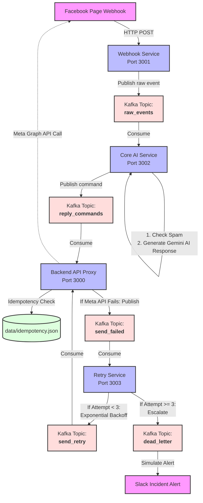

# 🤖 Facebook Page Automation System - Monorepo Microservices

Hệ thống tự động hóa phản hồi và quản lý tương tác trên **Facebook Page** được thiết kế theo kiến trúc **Event-Driven Microservices** và quản lý tập trung bằng mô hình **Monorepo**. 

Hệ thống tận dụng hàng đợi thông điệp **Apache Kafka** để đảm bảo khả năng mở rộng (scalability), xử lý bất đồng bộ (asynchronous processing), chống trùng lặp dữ liệu (idempotency), tích hợp trí tuệ nhân tạo **Gemini AI** để sinh câu trả lời tự động thông minh, và cơ chế thử lại lỗi tự động (exponential backoff retry).

---

## 📐 Kiến trúc Hệ thống & Luồng Dữ liệu (E2E)

Hệ thống bao gồm nhiều dịch vụ chuyên biệt tương tác với nhau thông qua các **Kafka Topics**:



---

## 📁 Cấu trúc Thư mục Dự án

```text
/
├── services/
│   ├── webhook-service/        # Nhận Webhooks từ Meta, ký xác thực chữ ký bảo mật (Port 3001)
│   ├── core-service/           # Lọc spam & Tích hợp Gemini AI sinh câu trả lời tự động (Port 3002)
│   ├── backend-api/            # REST API, Swagger UI, Check trùng lặp Idempotent & gửi tin (Port 3000)
│   └── retry-service/          # Cơ chế Exponential Backoff & quản lý hàng đợi lỗi DLQ (Port 3003)
│
├── shared/                     # Thư viện dùng chung của các microservices
│   ├── constants.js            # Khai báo tập trung các Kafka Topics dùng chung
│   └── logger.js               # Định dạng Logger console đẹp mắt, phân loại màu trực quan
│
├── docker-compose.yml          # Trình phối hợp Docker chạy toàn bộ infra (Kafka, Zookeeper, UI) & services
├── .env                        # Chứa cấu hình môi trường bảo mật (được gitignore)
├── .env.example                # File mẫu cấu hình môi trường cho phát triển
├── package.json                # Định nghĩa scripts tổng của Monorepo (npm run ...)
└── test_webhook.js             # Kịch bản giả lập webhook để test hệ thống End-to-End
```

---

## ⚙️ Cấu hình Môi trường (`.env`)

Tạo file `.env` tại thư mục gốc bằng cách sao chép file `.env.example` và điều chỉnh các giá trị:

| Biến Môi Trường | Giá trị Mặc định | Mô tả | Chi tiết |
| :--- | :--- | :--- | :--- |
| **PORT** | `3000` | Port chạy Backend API | Phục vụ Swagger UI & điều phối gửi tin nhắn |
| **GRAPH_API_VERSION** | `v23.0` | Phiên bản Meta Graph API | Sử dụng để giao tiếp với Facebook Page |
| **PAGE_ACCESS_TOKEN** | *Bắt buộc* | Facebook Page Access Token | Token có quyền `pages_messaging`, `pages_manage_metadata` |
| **PAGE_ID** | *Bắt buộc* | ID của Facebook Page | ID trang cần tự động hóa |
| **ADMIN_TOKEN** | `admin_thanhngan_123` | Bearer Token cho các API Admin | Bảo vệ các route nhạy cảm (tạo bài viết, xem insights) |
| **FACEBOOK_VERIFY_TOKEN** | `thanhngan` | Token xác thực Webhook | Điền vào trang cấu hình Webhook của Facebook Developer portal |
| **FACEBOOK_APP_SECRET** | *Bắt buộc* | Khóa bí mật của Ứng dụng | Dùng để xác thực tính toàn vẹn (X-Hub-Signature-256) |
| **WEBHOOK_SKIP_SIGNATURE**| `false` | Bỏ qua xác thực chữ ký | Đặt thành `true` khi chạy dev giả lập cục bộ |
| **GEMINI_API_KEY** | *Tùy chọn* | Google Gemini API Key | Nếu không cấu hình, Core Service sẽ tự động dùng Mock Response |

---

## 🚀 Hướng dẫn Cài đặt & Khởi chạy

### 📦 Cách 1: Chạy bằng Docker Compose (Khuyên dùng & Đơn giản nhất)

Yêu cầu máy tính của bạn đã cài đặt sẵn **Docker** và **Docker Compose**.

1. **Khởi chạy toàn bộ hệ thống:**
   ```bash
   npm run docker:up
   ```
   *Lệnh này sẽ tự động tải các image cần thiết (Kafka, Zookeeper, Kafka UI), build Dockerfiles cho 4 microservices và kích hoạt đồng thời.*

2. **Dừng hệ thống:**
   ```bash
   npm run docker:down
   ```

### 💻 Cách 2: Chạy Local trực tiếp (Chế độ Nhà phát triển)

Yêu cầu đã cài đặt **Node.js** (v18+) và có một cụm Kafka đang chạy (hoặc dùng docker để chạy riêng Kafka).

1. **Cài đặt thư viện gốc:**
   ```bash
   npm install
   ```
2. **Khởi chạy độc lập từng Service qua script npm:**
   - Chạy Webhook Service: `npm run dev:webhook`
   - Chạy Backend API: `npm run dev:backend`
   - Chạy Core AI Service: `npm run dev:core`
   - Chạy Retry Service: `npm run dev:retry`

---

## 📊 Danh sách Cổng Dịch vụ & UI Giám sát

Khi hệ thống đang hoạt động, bạn có thể truy cập các đường dẫn sau:

- **🌐 Backend API Entrypoint**: `http://localhost:3000`
- **📖 Swagger API Documentation**: `http://localhost:3000/docs` (Xem chi tiết tất cả API, tham số và thử nghiệm gửi nhận)
- **⚡ Webhook Receiver**: `http://localhost:3001/webhook` (Nơi nhận payload từ Facebook gửi sang)
- **🐳 Kafka UI Manager**: `http://localhost:8080` (Giao diện đồ họa giám sát trực quan các Topics, Consumers, Messages trong thời gian thực)

---

## 📖 Danh sách API Endpoints (Backend API)

Tất cả các API yêu cầu xác thực Admin cần đính kèm Header: `Authorization: Bearer <ADMIN_TOKEN>`

### 📝 Quản lý Bài viết & Nội dung
- **`GET /api/page/:pageId`**
  - **Quyền:** Public
  - **Mô tả:** Lấy thông tin chi tiết của Facebook Page.
- **`GET /api/page/:pageId/posts`**
  - **Quyền:** Public
  - **Mô tả:** Lấy danh sách các bài viết trên Page (Hỗ trợ query `?limit=10`).
- **`POST /api/page/:pageId/posts`**
  - **Quyền:** 🔐 **Admin Only**
  - **Mô tả:** Đăng bài viết mới lên trang Facebook.
  - **Body:** `{ "message": "Nội dung bài viết mới" }`
- **`DELETE /api/page/post/:postId`**
  - **Quyền:** 🔐 **Admin Only**
  - **Mô tả:** Xóa bài viết khỏi trang Facebook.

### 💬 Quản lý Tương tác & Phản hồi
- **`GET /api/page/post/:postId/comments`**
  - **Quyền:** Public
  - **Mô tả:** Lấy toàn bộ bình luận của bài viết chỉ định.
- **`GET /api/page/post/:postId/likes`**
  - **Quyền:** Public
  - **Mô tả:** Lấy danh sách lượt like/thả tim bài viết.

### 📈 Báo cáo & Thống kê
- **`GET /api/page/:pageId/insights`**
  - **Quyền:** 🔐 **Admin Only**
  - **Mô tả:** Truy xuất các chỉ số tương tác (impressions, engaged users, fans).

---

## 🧪 Quy trình Kiểm thử End-to-End (E2E Simulation)

Hệ thống đi kèm một file test kịch bản tự động gửi bình luận giả lập để kiểm tra độ tin cậy của toàn bộ luồng Event-Driven.

1. **Khởi chạy mô phỏng:**
   ```bash
   npm run test:webhook
   ```

2. **Theo dõi luồng xử lý qua Logs:**
   - **BƯỚC 1: Webhook Service tiếp nhận và chuẩn hóa dữ liệu**
     ```bash
     docker logs -f page-api-webhook-service
     ```
     *(Bạn sẽ thấy Webhook nhận payload từ `test_webhook.js`, chuyển đổi sang định dạng chuẩn và đẩy vào topic `raw_events`)*

   - **BƯỚC 2: Core AI Service nhận diện tin nhắn & Sinh câu trả lời**
     ```bash
     docker logs -f page-api-core-service
     ```
     *(Core Service đọc tin nhắn từ topic, lọc spam, gửi request đến Gemini AI (hoặc Mock) để lấy nội dung phản hồi, sau đó đẩy mệnh lệnh vào topic `reply_commands`)*

   - **BƯỚC 3: Backend API thực thi tương tác & Chống gửi trùng**
     ```bash
     docker logs -f page-api-backend
     ```
     *(Backend đọc mệnh lệnh từ topic, thực hiện kiểm tra cơ chế **Idempotency** (Chống trùng lặp tin bằng ID độc nhất). Nếu tin hợp lệ, nó sẽ gọi Meta Graph API để trả lời bình luận)*

   - **BƯỚC 4: Retry Service xử lý tự động khi có lỗi hệ thống**
     ```bash
     docker logs -f page-api-retry-service
     ```
     *(Nếu bước gửi tin từ Backend gặp sự cố mạng hoặc lỗi từ API Facebook, sự kiện lỗi sẽ đẩy sang `send_failed`. Retry Service sẽ tiêu thụ, tính toán thời gian chờ tăng dần (Exponential Backoff) và thực hiện gửi lại tối đa 3 lần trước khi đánh dấu là Dead Letter Queue (DLQ))*

---

## 🛠️ Bảo trì & Khắc phục sự cố

### 1. Sửa lỗi kết nối Kafka khi khởi động cục bộ
Nếu khởi chạy không dùng Docker và gặp lỗi `KafkaJSConnectionError`, hãy đảm bảo cụm Kafka của bạn đang chạy tốt và biến `KAFKA_BROKERS` trong file `.env` đã trỏ đúng IP/Port.

### 2. Kiểm tra lưu trữ Idempotent
File chống trùng lặp thông điệp nằm tại đường dẫn: `services/backend-api/data/idempotency.json`. Nếu bạn muốn reset toàn bộ lịch sử chặn trùng để test lại từ đầu, bạn có thể xóa nội dung trong file này (nhớ giữ lại dạng json hợp lệ `{}`).

---
*Phát triển và vận hành hệ thống microservices tự động hóa hàng đầu chuyên nghiệp bởi nhóm dự án.*
